# 📵VoicePassing

###  AI 분석 기반 실시간 음성 분석을 통한 보이스 피싱 감지 앱
###  SSAFY 8기 자율 프로젝트
 

 

## 👨‍👩‍👧‍👦팀원 소개

**[김범찬](https://github.com/veonico)** :  AI

**[김용현](https://github.com/dongind)** : Infra / Leader

**[박정희](https://github.com/lyeong-gwa)** : Backend

**[이재협](https://github.com/jhyeop)** : Frontend

**[전병현](https://github.com/0901jbh)** : Backend / Frontend

**[황산나래](https://github.com/HWANGSAN)** : Frontend / Backend

 

## 📆 프로젝트 소개

**⚙​ 개발 환경 및 IDE**

**Backend**

     

**Frontend**

   

**Server**

    

**실시간 음성 파일 변환**

   

**AI 분석**

    

**Cooperation & Communication**

    

- **진행 기간**: 2023.4.10  ~ 2023.5.19

 

# 📢 어플리케이션 설명
## AI 분석 기반 실시간 음성 분석을 통한 보이스 피싱 감지 앱
## 🌟주요 기능 - 실시간 음성 분석
  - 실시간 녹음 파일 전송
  - metadata가 없는 녹음 파일 복원
  - 녹음 파일 텍스트화
  - BERT 기반 AI 텍스트 분석
  - 분석 결과에 따른 유저 알림
## 부가 기능
- 검사 이력 조회
- 최근 범죄 통계
- 전화번호 검색
- 녹음 파일 검사

---
 

# 주요 기능 설명 - 실시간 음성 분석 

### 음성 분석 데이터 흐름도
- 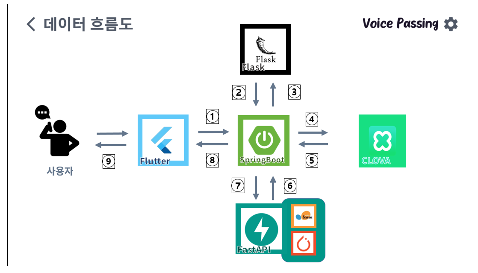
- 분석 순서 : A. 녹음 파일 전송 B. 파일 복원 C. 파일 텍스트화 D. AI 텍스트 분석 E. 알람

### 실시간 녹음 파일 전송
- 안드로이드의 통화 녹음 활성화 시 녹음되는 지정된 경로에 있는 신규 파일을 읽기
- 통화 녹음 파일에서 추가된 데이터를 일정 주기마다 서버에 전송

### metadata가 없는 녹음 파일 복원
- 안드로이드에서 전송 받은 녹음 파일은 작성 중 파일을 읽은 것으로 meta data가 존재 X
- 이를 복원하기 위해 docker untrunc 명령어 사용
- Flask를 통해 untrunc 서버 구현

### 녹음 파일 텍스트화
- Naver Clova Speech API 활용
- 파일 전송 후, 결과를 String으로 받고 목적에 맞게 파싱

### BERT 기반 AI 텍스트 분석
- <범찬>

### 분석 결과에 따른 유저 알림
- AI 서버의 분석 결과를 spring boot를 통해 받음
- 결과에 따라 유저에게 실시간 push 알림 전송
- 알림 내용 : 위험 수치, 키워드, 분석 문장

### 통화 중 실시간 알림
 
- 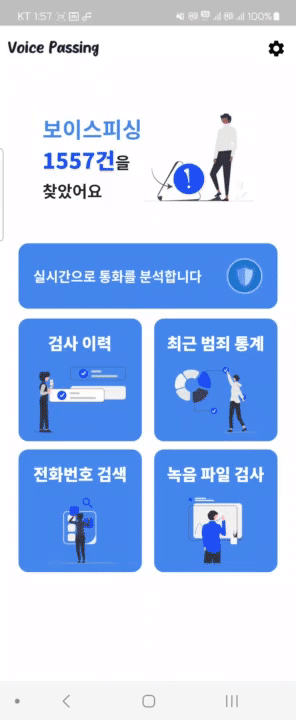
s
 

# 부가 기능 설명

- 검사 이력 조회
  - 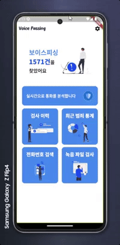
  - 최종 분석 결과에 따른 주의 혹은 위험한 결과 목록 확인
- 최근 범죄 통계
  - 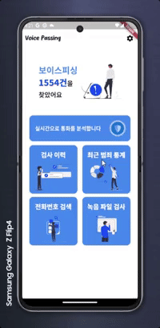
  - 최근 1달내에 적발된 범죄 유형, 키워드, 공통 문장 제공
- 전화번호 검색
  - 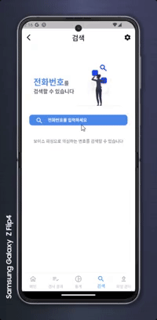
  - 악성 전화번호 조회
- 녹음 파일 검사
  - 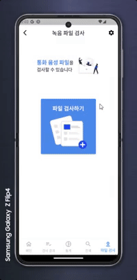
  - 검사 받을 음성 파일 분석 후 결과 보기

---

  

# 💁개발 방식 및 결과
## 🧱 시스템 구조도

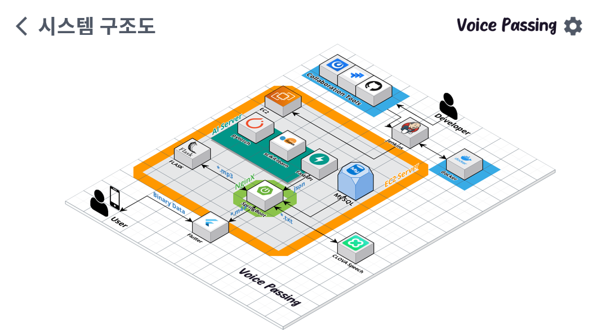

 

## 🌠 Server Description

- port (nginx)

  - | 포트  | 이름                                   |
    | ---- | -------------------------------------- |
    | 80   | HTTP - HTTPS로 리다이렉트(프론트 페이지) |
    | 443  | HTTPS                                  |
    | 3305 | MYSQL                                  |
    | 8000 | FastAPI                                |
    | 8080 | Spring boot                            |
    | 8100 | Jenkins                                |
    | 8300 | untrunc  server                        |
    
    

## 🎩 화면 설계서
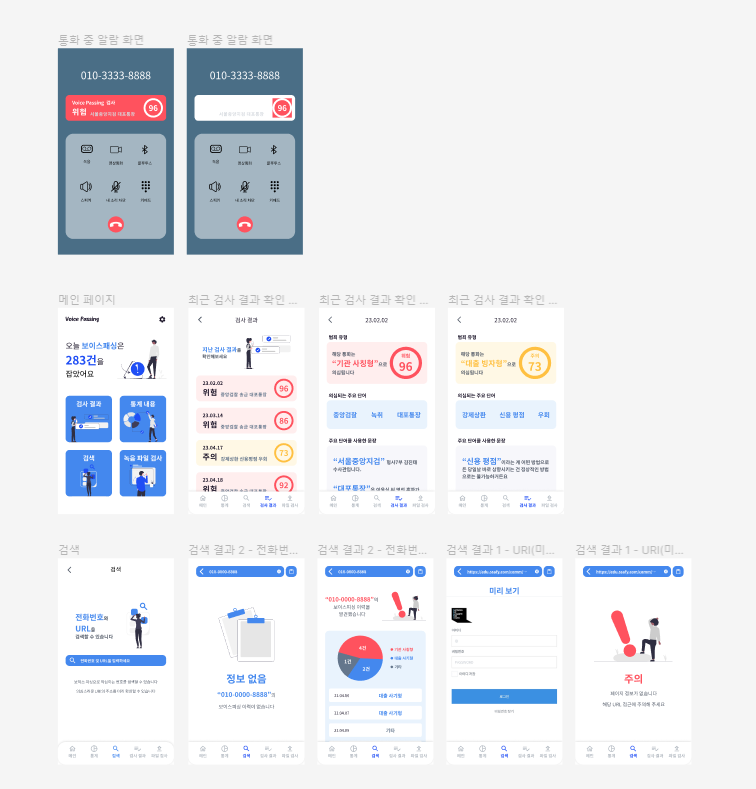

## 🎨 DB ERD
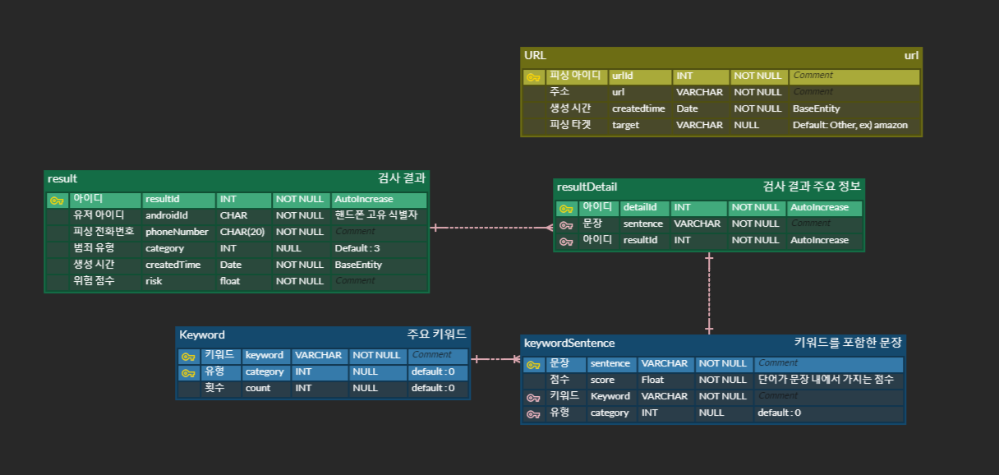

## 📬 API 명세서

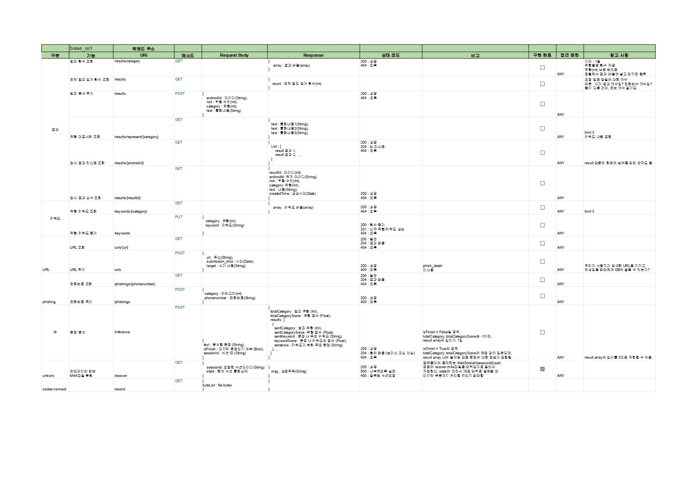

### 🌄 JIRA 컨벤션

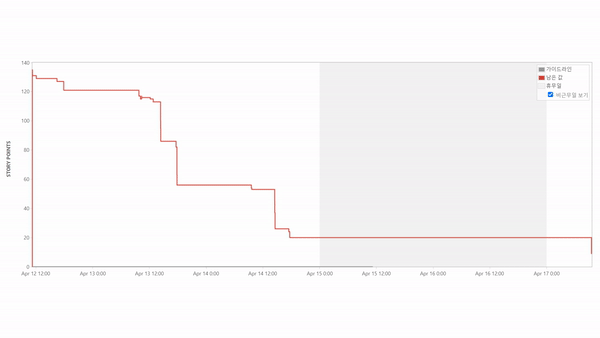

- 번 다운 차트

---
# 📵VoicePassing
